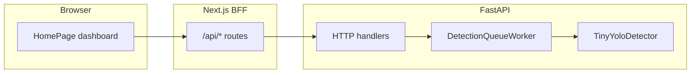

# Jetson AI Dashboard — System flow

This document describes how the assignment fits together: the browser dashboard, the Next.js API layer, the FastAPI backend, and the background detection worker. It is written for a walkthrough with reviewers; it does not duplicate source listings.

## Purpose

The app lets you play a sample MP4 in the browser, send frames to a Python service for YOLOv3-tiny object detection, and see results on the video overlay and in scrollable galleries. A small memory HUD shows approximate RAM usage when the backend runs in an environment that exposes cgroup or process stats (for example Linux or containers).

## High-level architecture

The **React client** runs in the browser and talks only to **same-origin** URLs under the Next.js app (for example `/api/enqueue`, `/api/results`). Those **route handlers** are thin proxies: they forward requests to the **FastAPI** service whose base URL comes from the `BACKEND_URL` environment variable (defaulting to localhost on port 8000).

FastAPI exposes REST endpoints for health, enqueueing frames, polling results, clearing session state, and reading runtime memory. A dedicated **worker thread** owns a bounded queue of pending frames and an ordered history of completed results. It decodes each frame, optionally resizes it, runs **OpenCV DNN** with Darknet weights for YOLOv3-tiny, and stores detections plus metadata for the UI to poll.

## Data shapes (conceptual)

**Enqueue** sends a JSON object with a data-URL style base64 image string, a client timestamp in milliseconds, and optionally the video’s current playback time in seconds so the UI can label frames with a clock.

**Results** are returned as a list of objects keyed by monotonic frame id. Each item includes the original image data for thumbnails, normalized bounding boxes with COCO class names and confidence scores, optional error text if inference failed, and timing fields for correlation with the video.

**Memory** responses indicate whether usage could be read, then used megabytes, optional limit megabytes, and optional usage percent when a limit is known.

## End-to-end: single frame capture (manual)

1. The user clicks **Capture Frame** while **live** mode is off. The client draws the current video frame onto a hidden canvas, scaled so the long edge matches a fixed pixel cap to match the backend resize and keep payloads small.
2. The frame is encoded as JPEG and posted to the Next.js enqueue route, which forwards to FastAPI **POST /enqueue**.
3. The worker assigns the next frame id, enqueues the payload if the queue is not full, and returns that id to the client. The client records the id as pending.
4. The results poller (running whenever there are pending ids or live mode is on) calls **GET /results** with a cursor (`afterId`) set to the last frame id the client has fully merged. New rows are appended to local history maps, capped to a maximum number of frames. The newest result updates the video overlay and status line; pending ids are cleared for frames that arrived.
5. The user can open the **Selected Gallery Frame** panel, move **Prev** / **Next**, and inspect thumbnails in **Frames history** and **People frames** (the latter filters to frames where a person was detected).

## End-to-end: live analysis

1. The user enables **Start Live Analysis** and chooses an interval in milliseconds.
2. A timer repeatedly invokes the same capture path as manual capture, with guards to avoid overlapping captures and to limit how many frames can be outstanding at once relative to the queue.
3. Polling uses a shorter interval than in manual-only mode so the overlay feels responsive while frames are streaming.
4. **Clear Overlay** and **Clear Session** are disabled during live mode so state does not race with continuous capture; stopping live restores those controls.

## Session clear

When live mode is off, **Clear Session** posts to the Next.js proxy, which calls FastAPI **POST /session/clear**. The worker drains its queue, clears stored results, and resets the frame id counter. The client resets its local history, selection, overlay, and polling cursor.

## Memory HUD

On load and on a fixed interval, the client fetches **GET /api/runtime/memory**, which proxies **GET /runtime/memory** on FastAPI. The backend reads cgroup memory files when available (v1 or v2), subtracts inactive file cache where applicable to approximate working set, and falls back to process RSS from proc. The UI shows a text summary and a small sparkline of recent samples.

If the proxy cannot reach the backend, the memory route may respond with an error-shaped JSON so the pill can show an offline state without breaking the rest of the page.

## Concurrency and backpressure

The worker uses a **bounded queue**. If enqueue returns no slot, FastAPI responds with HTTP 429 and the UI can surface a queue-full message. Result history on the server is also bounded; the client mirrors that with its own cap so memory stays predictable during long runs.

Polling uses a ref flag so only one in-flight results request runs at a time; capture uses a similar guard. These patterns avoid stampedes and odd ordering when the network or GPU is slow.

## Operational notes

- **Health**: **GET /health** on FastAPI returns a minimal OK payload for probes.
- **Startup / shutdown**: FastAPI startup starts the worker thread; shutdown asks it to stop and joins briefly.
- **Model files**: The detector expects Darknet cfg, weights, and COCO names under the backend models directory; missing files produce a clear startup error from the worker path.

## Summary

The browser never talks to FastAPI directly; Next.js routes unify configuration and CORS concerns. FastAPI keeps ingestion and inference off the request thread via a single consumer thread, exposes cursor-based polling for results, and optional memory introspection for demos on Linux-like runtimes. The UI ties capture timing to video playback time, shows detection overlays on video and on the selected still, and filters a secondary gallery for person detections.
